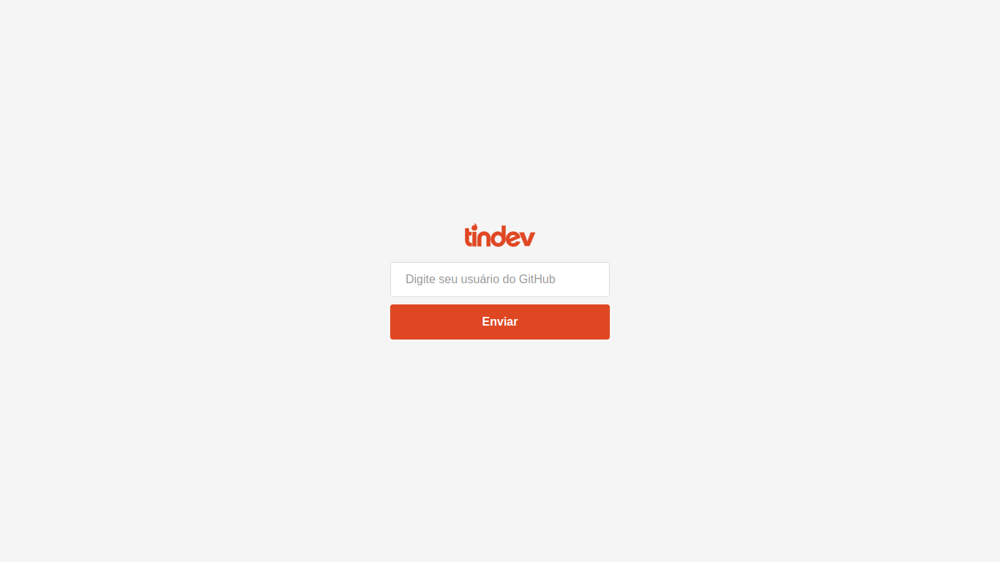
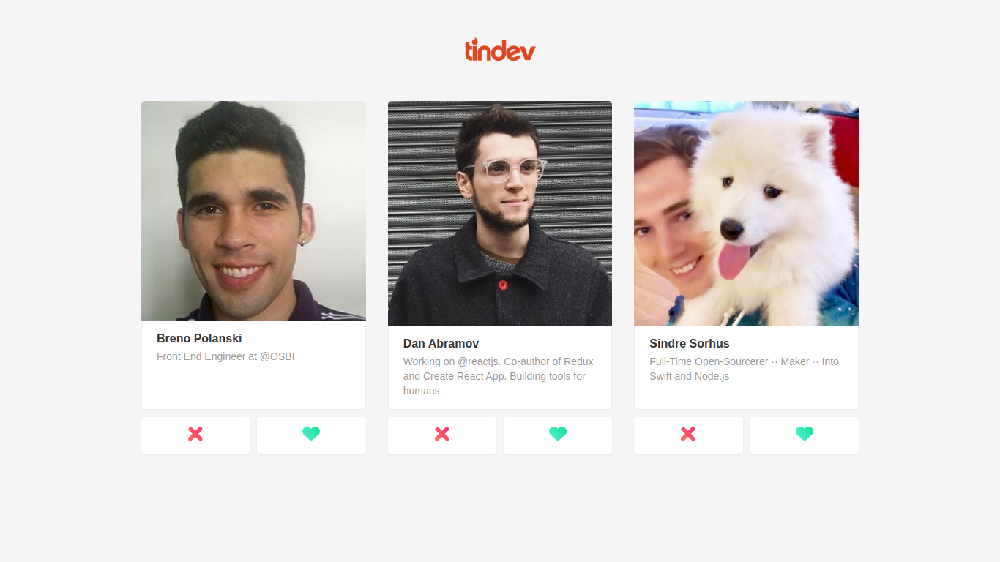
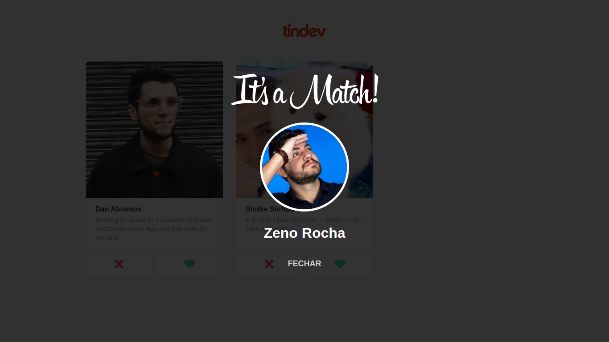
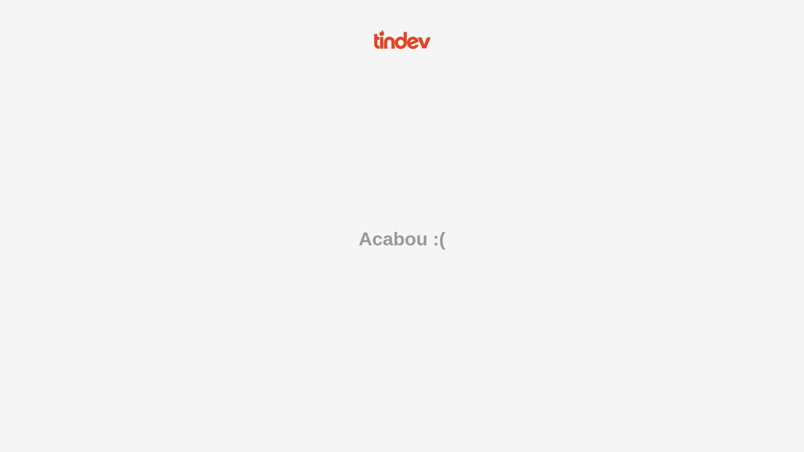
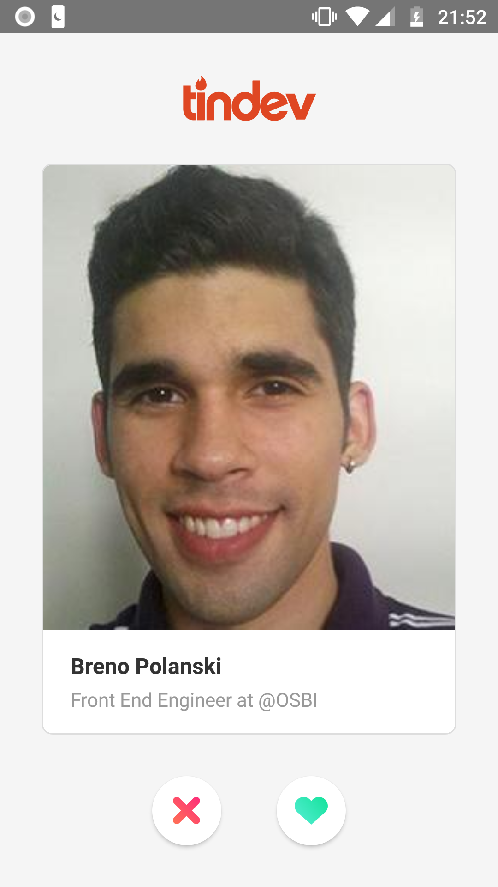

<h1 align="center">
  
</h1>

## Quick Start

First of all, install the dependencies to run this app.

- [NodeJS](http://nodejs.org/)
- [Yarn](https://yarnpkg.com/lang/en/docs/cli/install/)

```bash
# Clone this repository
$ git clone git@github.com:brenopolanski/tindev.git

# Go into the repository
$ cd tindev

# Go into the backend and install dependencies
$ cd backend
$ yarn install

# Create .env file and add database url
$ echo "MONGO_URL='mongodb+srv://<username>:<password>@cluster0-dddme.mongodb.net/tindev?retryWrites=true&w=majority'" >> .env

# Run backend
$ yarn dev

# Go into the frontend and install dependencies
$ cd frontend
$ yarn install

# Run frontend
$ yarn start

# Go into the mobile and install dependencies
$ cd mobile
$ yarn install

# Run app (ios)
$ yarn ios

# Run app (android)
$ yarn android
```

## Technologies

**Backend:**

- [Node.js](https://nodejs.org/en/)
- [Express](https://expressjs.com/)
- [Mongoose](https://mongoosejs.com/)
- [Nodemon](https://nodemon.io/)
- [Cors](https://github.com/expressjs/cors)
- [Axios](https://github.com/axios/axios)
- [Socket.io](http://socket.io/)

**Frontend:**

- [React](https://reactjs.org/)
- [React Router](https://reacttraining.com/react-router/)
- [Axios](https://github.com/axios/axios)
- [Socket.io client](https://github.com/socketio/socket.io-client)

**Mobile:**

- [React Native](https://facebook.github.io/react-native/)
- [React Navigation](https://reactnavigation.org/)
- [Axios](https://github.com/axios/axios)
- [Socket.io client](https://github.com/socketio/socket.io-client)

## Screenshots

### Browser App

<p align="center">
	
	
	
	
</p>

### Mobile App

<p align="center">
  
  
  
  
</p>

## License

[MIT License](https://brenopolanski.mit-license.org/) © Breno Polanski
